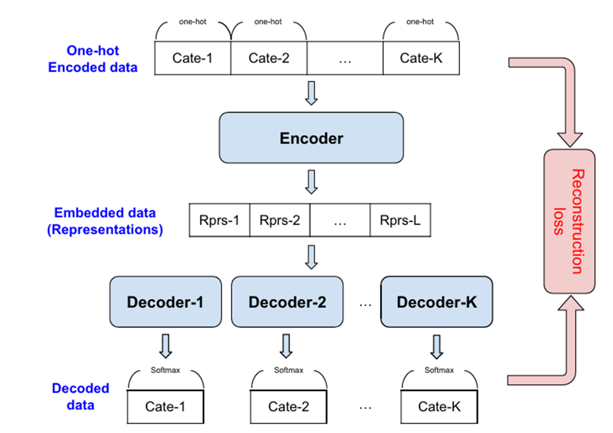
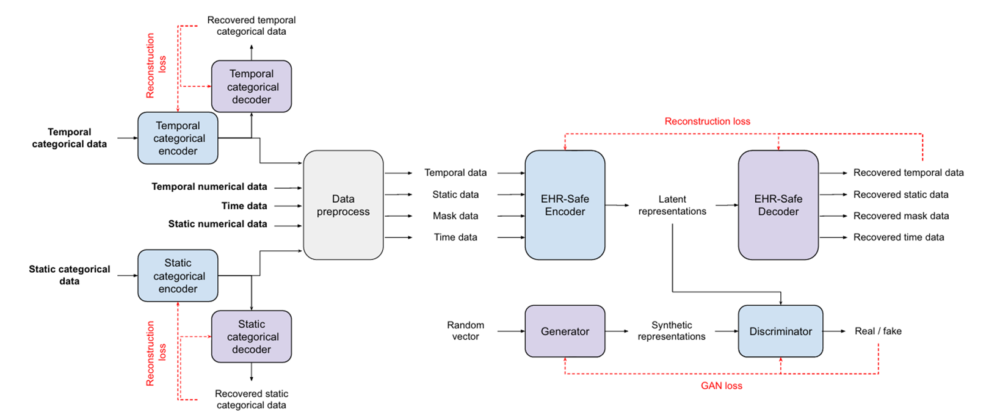
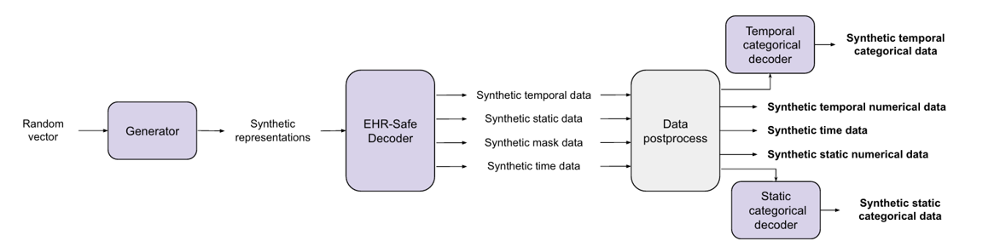
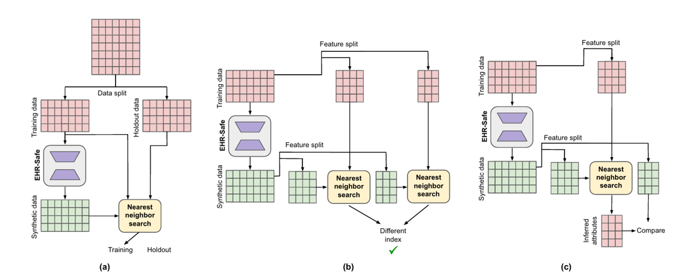

# Privacy-Preserving Synthetic EHR Generation (EHR-Safe Framework)

## Overview
Real healthcare data is incredibly valuable for research but is difficult to access due to privacy risks, legal restrictions (HIPAA, GDPR), and slow institutional processes. 

This project implements the **EHR-Safe Framework**, a solution designed to generate **synthetic Electronic Health Records (EHRs)**. These synthetic records mimic the statistical patterns and complex distributions of real data without exposing real patient identities, allowing researchers to train machine learning models and share datasets freely.

## Key Features
* **Heterogeneous Data Support:** Successfully models a mix of numerical, categorical, static, and time-varying features.
* **Missingness Handling:** Learns and preserves realistic missing data patterns found in clinical settings using binary masks.
* **Privacy-First Design:** Generates data from random noise vectors, ensuring no one-to-one mapping between real and synthetic records.
* **Scalable Generation:** Capable of generating unlimited volumes of instantly shareable data.

---

## System Architecture

The framework utilizes a **Generative Adversarial Network (GAN)** enhanced with an **Encoder-Decoder architecture** to handle the complexity of longitudinal medical data.

### 1. Data Representation
The model processes five specific feature categories for each patient record:
* **Static Features:** Baseline measurements (Numeric) and demographics like ethnicity/gender (Categorical).
* **Time-Varying Features:** Vitals/Labs (Numeric) and medical codes/medications (Categorical).
* **Measurement Time:** Timestamps tracking temporal events.
* **Masks:** Binary indicators used to represent whether data is observed or missing.

### 2. Pre-processing Pipeline
To handle the irregularities of medical data, two primary techniques are applied:
* **Categorical Encoder-Decoder:** Compresses high-dimensional sparse data (such as medical codes) into compact learned embeddings.

* **Stochastic Normalization:** Converts discontinuous or skewed numerical distributions into a uniform space to prevent mode collapse during GAN training.

### 3. Core Model Components
* **Encoder:** Transforms raw, mixed-type EHR data into a compact latent embedding.
* **WGAN-GP (Generative Adversarial Network):**
    * **Generator (G):** Learns to produce synthetic latent vectors from random noise.
    * **Discriminator (D):** Distinguishes between real and synthetic representations to improve realism.
* **Decoder:** Reconstructs the synthetic latent embeddings back into the original feature space.

---

## Inference Pipeline (Generation)

Once the model is trained, the Encoder and Discriminator are discarded. The data generation process follows these steps:

1.  **Sample Noise:** Random vectors are drawn from a normal distribution.
2.  **Generate Embeddings:** The **Generator** converts the random noise into synthetic latent representations.
3.  **Decode:** The **Decoder** reconstructs the static, temporal, and mask features from the embeddings.
4.  **Post-process:** Categorical embeddings are decoded back to labels, and numeric data is renormalized to produce the final synthetic records.

---

## Privacy Framework

Unlike traditional de-identification, this framework ensures that synthetic data cannot be traced back to specific individuals. The model is evaluated against three standard privacy attack scenarios:

1.  **Membership Inference Attack (MIA):** Confirms the model does not leak whether a specific record was used in training.
2.  **Re-identification Attack:** Ensures synthetic records remain statistically distant from real data to prevent linking to specific individuals.
3.  **Attribute Inference Attack (AIA):** Ensures that the synthetic data reveals no additional sensitive attribute information compared to general population statistics.

---

## Future Directions
* **Equitable Synthesis:** Enhancing the model to improve fairness and coverage for underrepresented demographic subgroups.
* **Downstream Validation:** Further evaluating the utility of the synthetic data in complex predictive modeling and healthcare tasks.